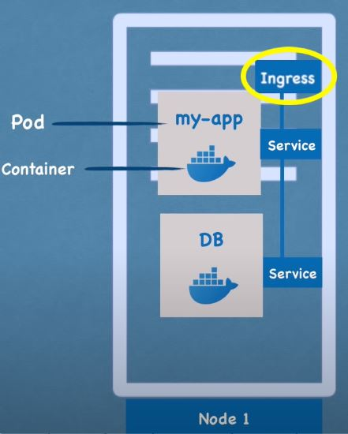
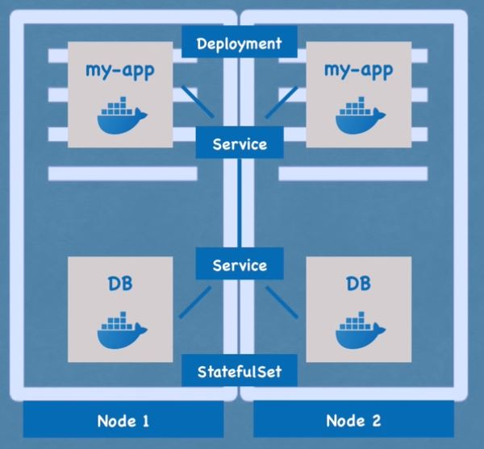
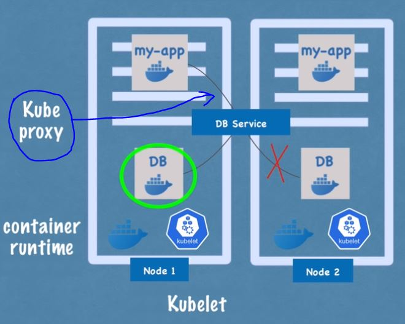
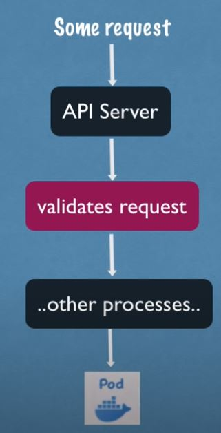
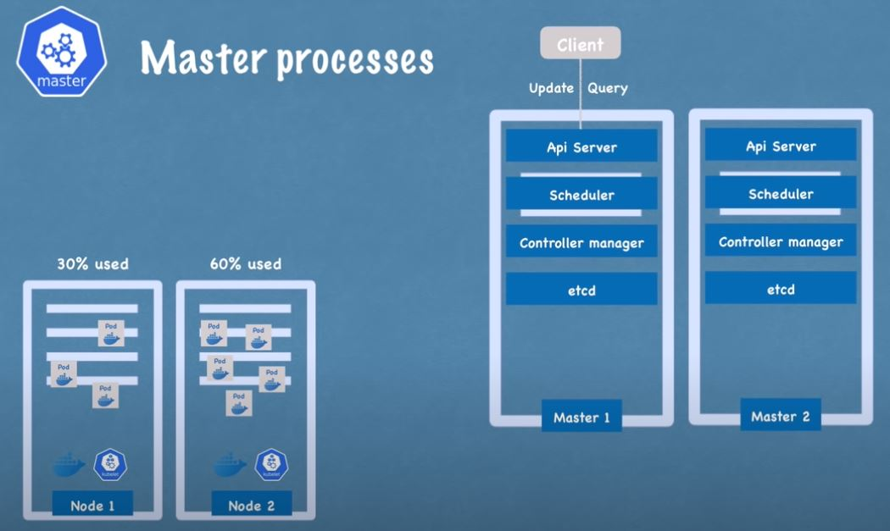

# Kubernetes-ArgoCD-Guide

Here I try to Create end to end flow with Kubernetes and ArgoCD.

## 1. what it is?

1. Open source container orchestration tool
2. Developed by Google.
3. Manage Containerize Applications

## 2. Advantage

1. High Availability
2. Scalability
3. Disaster Recovery

## 3. Kubernetes Components

### 3.1 Pods

1. Smallest Unit
2. Abstraction over Container
3. 1 Application per pod.
4. Each pod gets it own IP Address.

`Issue` : If service ran out of resources then pod will die and it will create a new pod with new IP address which is not great because pods will talk to each other with IPs. So we attach to service component.

### 3.2 Service

1. Permanent IP address to each pod
2. Attach to pod but life cycle of pod and service is not attached means if pod dies service component still intact.
3. 2 Type of service
   1. internal Service
   2. external Service
4. Work as a load Balancer between 2 or more pods.

### 3.3 Ingress

1. Request from outside first go to ingress and then forward to service.

### 3.4 Config Map

1. URLs and Endpoints are stored in config so if URL gets changes than only need to change in config map

### 3.5 Secret

1. It is used to store credentials
2. Base64 encoded

### 3.6 Volume

1. A physical device is attach to pod.
2. Prevent data lose when pod restart or crashed.
3. Its not taken care by kubernetes.

### 3.7 Replication

1. Deployment file is a blueprint of pod
2. Deployment file handle pods replication.
3. Deployment file is for stateless component.
4. Now on if pod dies then request will be forwarded to another pod
5. Database read and write state be handled by statefulSet but
6. Deploying statefulSet is not easy process. Common practice is to host database outside the kubernetes cluster.

## 4 Kubernetes Architecture

Its a master slave configuration.

### 4.1 Node

1. Each node has multiple pods.
2. 3 process must be installed on every Node.(Container Runtime, Kubelets, Kube proxy)
3. Worker node do the actual work.
4. Kubelet is responsible running, starting, restarting and assign resources to containers.
5. Kube Proxy ensure that request is handle in same node.

### 4.2 Master Process

#### 4.2.1 API Server

1. Its like a cluster gateway.
2. acts as a gatekeeper for the authentication.
3. Request first come to API Server.

   

#### 4.2.2 Scheduler

1. Where to put the pod.
2. if any node has less resource utilization then next pod will be assign to that particular node.
   

#### 4.2.3 Controller Manager

1. Detect state change in pod. If crashed then create new pod.
2. Make request to schedular and schedular assign pod to node according to resource availability.

#### 4.2.4 etcd

1. it's a key value store.
2. Cluster Brain(state change, resource info, cluster health)
3. Application data is not stored in `etcd`

## 5. Software

1. Minikube (Have dependancy Kubectl )
2. Docker Runtime (Container for MiniKube)

## 6. Layer of Abstraction

1. Deployment manages a Replica-Set
2. Replica-Set manages a pods.
3. Pods Manages a container runtime.
4. Below everything is manage by Kubernetes

## 7 Namespaces

1. Organize Resources in namespace.
2. Virtual cluster inside cluster.
3. There are some default namespaces
   1. kube-system: System related data or system process.
   2. kube-public : publicly access able data
   3. kube-node-lease: contains the info of the heartbeat
   4. default namespace
4. Use Case
   1. Group Resources in Namespace for better management
   2. Isolated environment between different team
   3. Blue/Green Deployment (means pro production cluster with production namespace)
   4. Limit resource within namespace
5. access service from different namespace using (service-name.namespace-name)
6. Persistance volume is not bound to any namespace (live globally)

## Kubernetes Config

Has 2 parts

1. metadata: container name
2. specification: service specification (like image-name, port)
3. status (auto generated)

if actual status and desired status not match then Kubernetes fix that.

status data comes from `etcd` (Brain)

`metadata` contains `labels` and `spec` contains `selectors` through which config gets connect to deployment

deployment metadata labels used by service component.

# Issues Solution

1. ArgoCD Path in window CMD Terminal : `kubectl patch svc argocd-server -n argocd -p "{\"spec\": {\"type\": \"LoadBalancer\"}}"`
2. ArgoCD Login : `argocd-windows-amd64.exe login localhost:8080`

# Resource

1. https://minikube.sigs.k8s.io/docs/start

2. https://minikube.sigs.k8s.io/docs/drivers/docker

3. https://argoproj.github.io/argo-cd/getting_started

4. istio-ingress installation: https://www.youtube.com/watch?v=voAyroDb6xk

5. TLS Certificate Place: https://support.kerioconnect.gfi.com/hc/en-us/articles/360015200119-Adding-Trusted-Root-Certificates-to-the-Server

6. https://cloud.google.com/kubernetes-engine/docs/how-to/ingress-multi-ssl

7. https://metallb.universe.tf/installation/

8. MetalLB Setup : https://www.youtube.com/watch?v=xYiYIjlAgHY&t=546s
