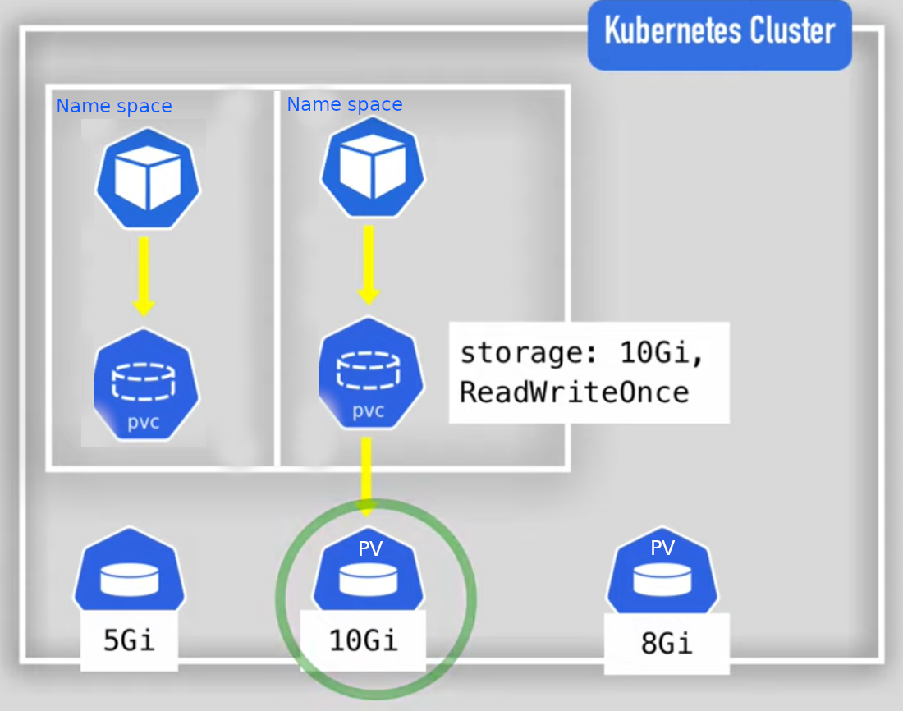

# Volumes

There are 3 type of volume in Kubernetes

1. Persistent Volume
2. Volume Claim
3. Storage Class

## 1. Persistent Volume

It is very use full for stateFull Application like databases where you have to maintain the current state of the data. Imagine a situation where you have a service and use application uses a database. At some point your service crashed and you lost the data. But that time you don't care much because in service you don't have to maintain the service data (stateless). But in case your database pod crashed then its become very serious issue. You will defiantly loss valuable data Because every container which is running on pod have their own fileSystem. If pod gets deleted then you will loss the fileSystem as well where you were storing data.

So what is the solution here?

Solution is Persistent Volumes. These persistance volumes actually occupy storage on the machine. So in case you pod gets crashed then pod will pick up data from the persistent volume and start from where its crashed.

1. Persistance Volume are not namespaced. Means same persistent volume can be claimed in any namespace
2. Defined in YAML File.

its best practice to always use remote storage.

## 2. Persistent Storage Claim

Every pod need to claim storage from Persistent volume. Volume are first bounded to pods then can be used differently in pod container.

For example. If you have created a deployment file and attached claimed volume to a pod with 2 container. So you can allow one container to use claimed volume and another to not.

Persistent Storage claim is namespaced. You can only use the persistent storage inside the namespace if you claimed inside it.

## 3. Storage Class

Its provision storage dynamically When PVC (`Persistent Volume Claim`) demands it. Its saves us to make so many persistent storage for different different storage. because its so time consuming.

Storage Backend is defined in the Storage Component Class.

- via `provisioner` attribute.
- internal provisioner is `kubernetes.io`
