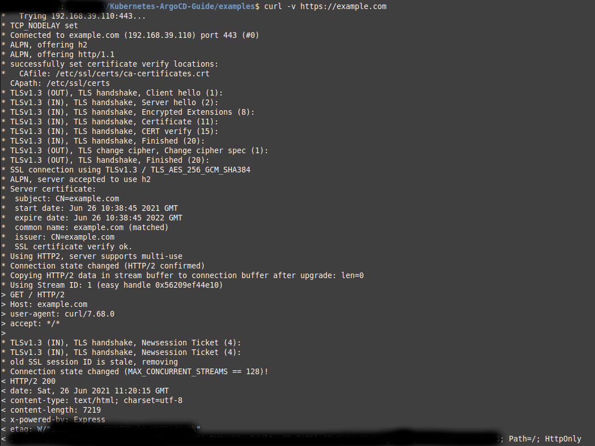

# Full Scale Service with TLS Certificate

## 1. Install OpenSSL on window

Help Link: https://tecadmin.net/install-openssl-on-windows

##

Create Certificate :

```bash
openssl req -x509 -newkey rsa:4096 -sha256 -keyout tls.key -out tls.crt -days 365
```

Access Locally Add ip with host name in

1. linux/ubuntu/mac : /etc/hosts
2. window: C:\Windows\System32\drivers\etc

## Install Self Signed Certificate

1. Create a new key

```
openssl genrsa -out rootCA.key 2048
```

2. Create a service Request Certificates

```
openssl req -new -key rootCA.key -out rootCSR.csr -subj "/CN=example.com"
```

3. Sign the certificate using rootCA key

```
openssl x509 -req -days 365 -in rootCSR.csr -signkey rootCA.key -out rootCRT.crt
```

## install Certificate in linux

1.

```
sudo cp rootCRT.crt /usr/local/share/ca-certificates/
```

2.

```
sudo update-ca-certificates
```

for other system follow Root [readme.md file here](../../README.md)

## Remove Certificate

1.

```
sudo rm /usr/local/share/ca-certificates/rootCRT.crt
```

2.

```
sudo update-ca-certificates --fresh
```

## Result


