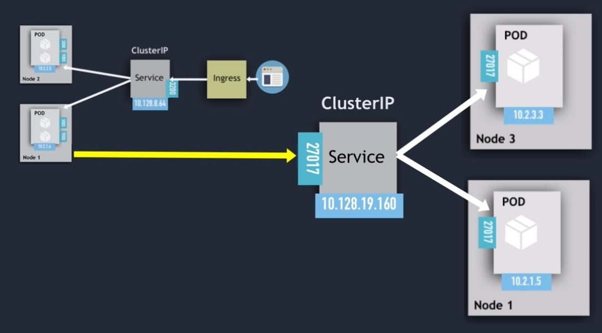
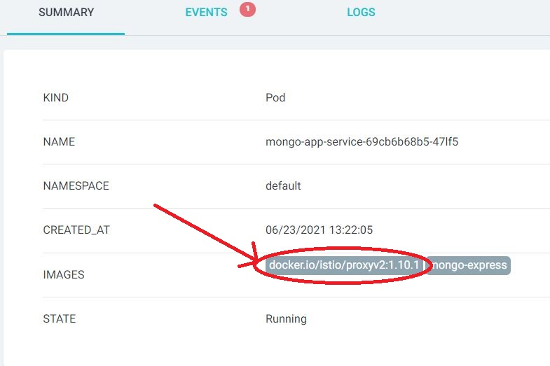
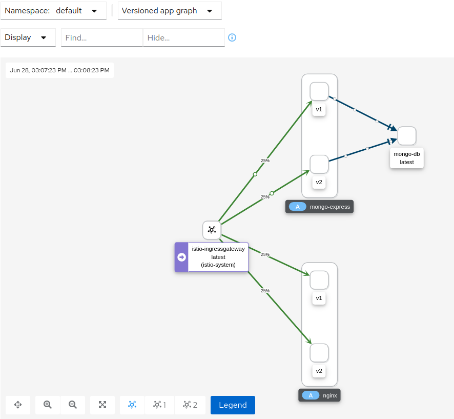

# Ingress

To access service from browser we use ingress. First request come to ingress then redirected to service component. In this case service component not require to act as a load balancer(externally expose by assigning ip).

## 1.



## Use

to use istio in local projects like this example project, need to add istio web hook first using

```bash
kubectl label namespace default istio-injection=enabled
```

this will inject enovy proxy automatically

Then only enovy proxy will be injected in each container
can be checked using `kubectl describe pod-name`



If you are using istio local then run the following

```
kubectl port-forward -n istio-system service/istio-ingressgateway 15021
```

in order to make request to istio default gateway at using port 15021

## Getting Telemetry Data

There are some istio ingegration which can be found [here](https://istio.io/latest/docs/ops/integrations/)

to install them just download respective system package from [here](https://github.com/istio/istio/releases/tag/1.10.1)
and then

```bash
kubectl apply -f ./istio-1.10.1/samples/addons
```

## Solution For Pending External IP in istio

did you notice that when a load balancer type service is created that External IP remain pending forever.

To assign external IP to LoadBalancer type service need a `MetalLB`.

it is a load-balancer implementation for `bare metal` Kubernetes clusters.

If you are using kubernetes on virtual service or on local machine you need to use this other wise you have to use port forwarding as mentioned above. If you are using `GCloud` service or any `cloud based service` they provide by default External IP

Link : https://metallb.universe.tf/installation/

### Supported Integration

1. cert-manager
2. Grafana
3. Jaeger
4. Kiali
5. Prometheus
6. Zipkin

## Result

