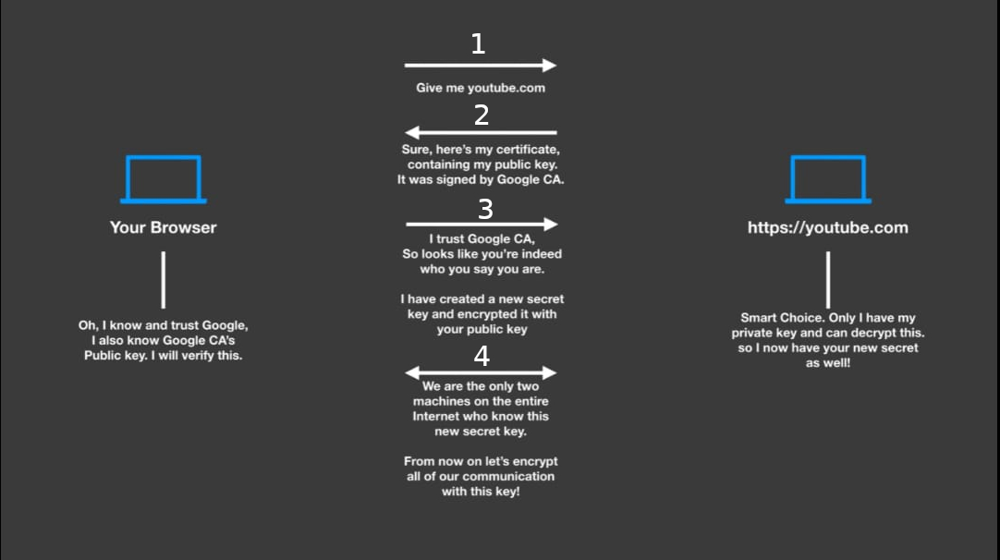
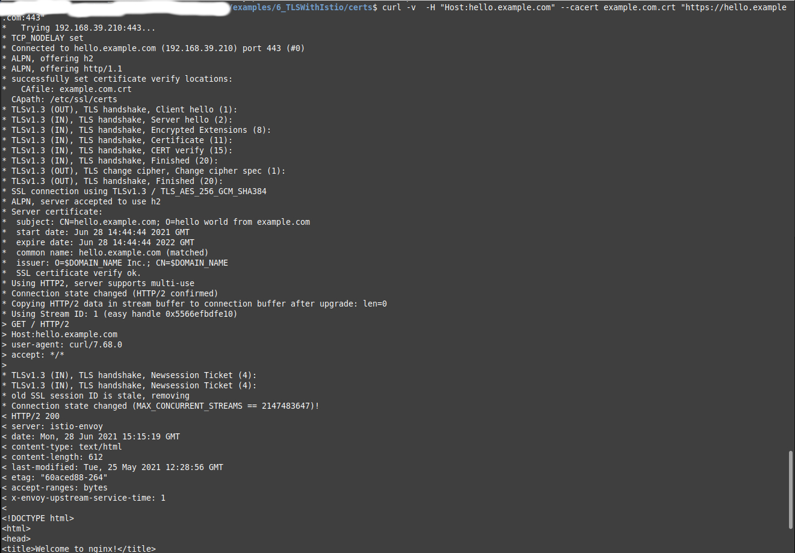

# Istio with TLS Security

1. Creating the cert files

let suppose `example.com` is certificate provider just like `Google` and `Amazon` (only assume) and they already have `crt` and `key` which we will create below.

```sh
export DOMAIN_NAME=example.com

openssl req -x509 -sha256 -nodes -days 365 -newkey rsa:2048 -subj '/O=example.com Inc./CN=example.com' -keyout $DOMAIN_NAME.key -out $DOMAIN_NAME.crt
```

2. The next step is to create the certificate signing request for our web site and the corresponding key:

here I am creating key for my website `hello.example.com` so `example.com` can validate my website

```sh
openssl req -out hello.$DOMAIN_NAME.csr -newkey rsa:2048 -nodes -keyout hello.$DOMAIN_NAME.key -subj "/CN=hello.example.com/O=hello world from example.com"
```

3. Finally using the certificate authority and it's key as well as the certificate signing requests, we can create our own self-signed certificate:

Here `example.com` validating the certificate and provide a varifired certificate to us.

```sh
openssl x509 -req -days 365 -CA $DOMAIN_NAME.crt -CAkey $DOMAIN_NAME.key -set_serial 0 -in hello.$DOMAIN_NAME.csr -out hello.$DOMAIN_NAME.crt
```

4. Request to Test the Service

```sh
curl -v  -H "Host:hello.example.com" --cacert example.com.crt "https://hello.example.com:443"
```

# How TLS Work ?



# Result


