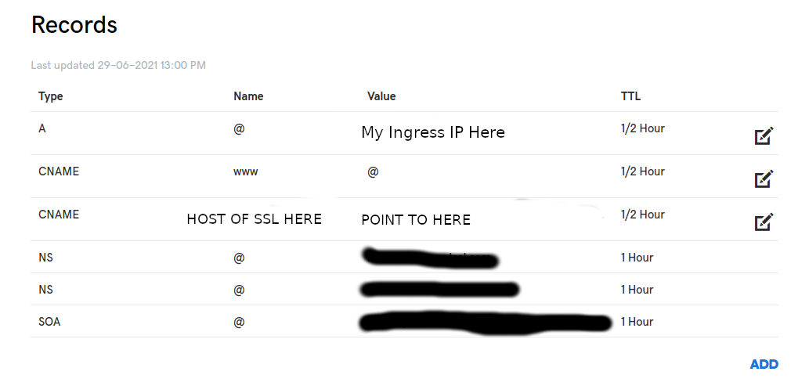
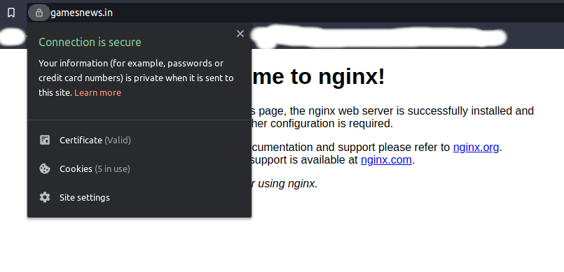

# Verified from Certificate Authority

## Requirement:

1. One Domain Name (I have one domain name `gamesnews.in` for testing from `GoDaddy`)
2. `sslforfree.com` account to create free ssl certificate for yor domain

# Steps

1. Create a Certificate from `sslforfree.com` and they will provide a zip bundle

2. You will have 3 files in it

   1. ca_bundle.crt

   2. certificate.crt

   3. private.key

3. Now there is 2 ways to create secret.

   1. using CMD

   ```sh
    kubectl create -n istio-system secret tls service-credential-name --key=certificate.key --cert=private.key.crt
   ```

   2. Convert these 2 files data and encode them into base64 using `https://www.base64encode.net/` and appropriately into istio-secret

4. Add INGRESS_IP into GoDaddy Domain DNS Record (I am using linux machine locally so I have add my local ingress IP into record)

   

5. Add the same domain name into virtual gateway hosts and istio-gateway hosts

6. Apply all the files to the cluster then check.

# Result


